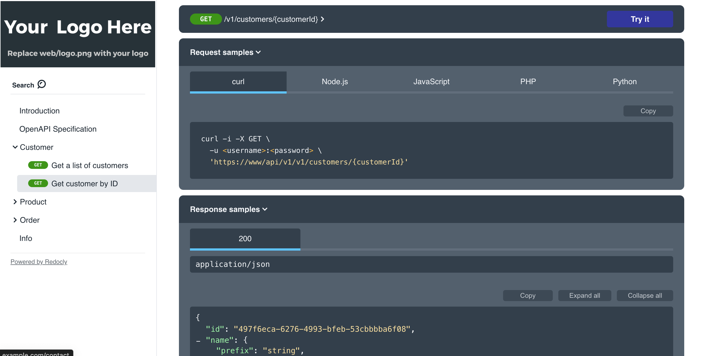

# Simple Store API

### Technologies
- OpenAPI 3.0
- Redocly
- Java 21
- Spring Boot 3.3.2
- Maven

## Working with the OpenAPI Definition

### Install

1. Install [Node JS](https://nodejs.org/).
2. Clone this repo and run `npm install` in the repo root.

### Usage

#### `npm start`
Starts the reference docs preview server.

#### `npm run build`
Bundles the definition to the dist folder.

#### `npm test`
Validates the definition.

